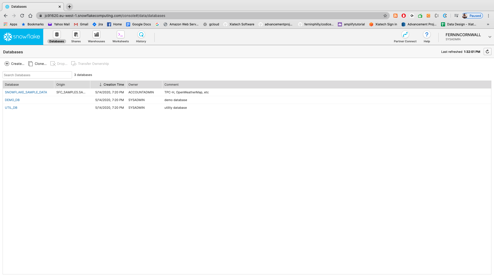
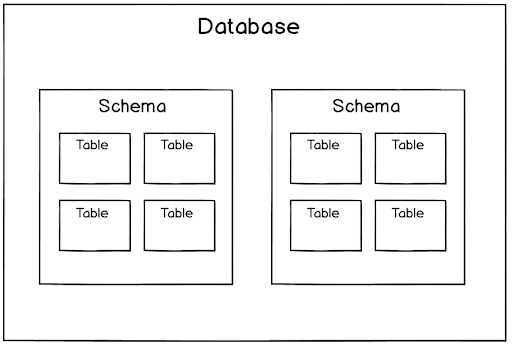
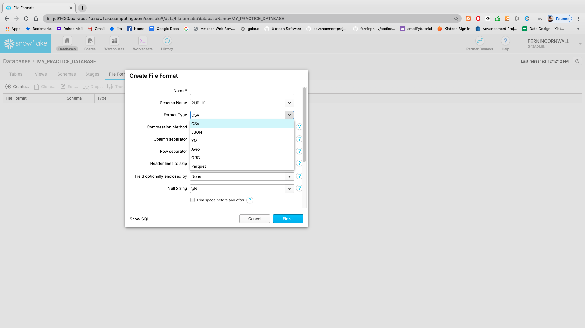

# LAB ONE

## Setting up

One of the biggest issues around snowflake is the fact that we can't simply grab a docker version of it; Snowflake keeps their data close!
So this means that unfortunately we _have_ to sign up for the 30 day free trial of snowflake...which we're going to have to do here.
Head over to [this](https://trial.snowflake.com/) site and please fill in the appropriate data.


* Please choose AWS as your **cloud provider**

Once you have completed registration (and clicked the activation link in your email) you are ready to go! You should see a screen that looks vaguely like this:


### Let's explore our initial screen!

SO- now that we are registered let's take a quick tour of some of the sections of our screen. Take a look at the top area (next to the snowflake logo):


You should see five areas immediately next to the snowflake section:
* Databases
* Shares
* Warehouses
* Worksheets
* History

Let's go through each of these as an intro:

### Databases



So let's start by creating a database (pretty basic, right?). Okay- so to create a database we can follow the GUI. Click on the "CREATE" and put in the names below:


Now click on your database name and we get to a screen with several tabs (under "DATABASES"). You should see seven tabs there:

* **Tables:** Fairly obvious: this is the list of tables. We can create one here with the "+" in the top left. 

* **Views:** Same as in other SQL databases- views are sql-generated tables that we can use for things like limiting date ranges on large tables.

* **Schemas:** Essentially one step down from "databases". For anyone not familiar with the hierarchy: DATABASES can contain multiple SCHEMAS which can contain multiple TABLES:



**Please take action here:** Let's create a schema here called "practice".

* **Stages:** Now _this_ is something you might not be used to seeing (and we'll cover this in more detail later). **Stages** in Snowflake are, essentially, external data repositories. I'm going to quote a pretty popular blog about it here:

> A critical part of any Snowflake database is the storage of the data. Snowflake is capable of
> both storing data within the environment and accessing data that is stored in other cloud 
> storage environments. Regardless of whether the data is stored internally or externally, the
> location the data is stored in is known as a stage. In turn, the process of uploading files
> into one of these stages is known as staging. [source](https://interworks.com/blog/chastie/2019/12/05/zero-to-snowflake-staging-explained/)

* **File Formats:** One of the nice things about Snowflake is the easy loading of data from various file formats. This is another thing we'll go into more detail about later but in the short term there are several formats available, including **semi-structured** and **structured** for loading data. In the short term, open up the "Format type" and take a quick look at the various format types available:



* **Sequences:** Another thing that we'll go into more detail about later is the concept of "sequences" in Snowflake...so take this one with a grain of salt. That being said: in the short term just think of sequences as a "primary key creator".

* **Pipes:** Snowflakes version of data pipelines...yet ANOTHER thing we'll be going deeper into later but the short version is: Snowpipes are sort of event driven data pipelines for loading data into Snowflake (so we can avoid having to use batches and COPY commands)

## Let's install supporting software

### SNOWSQL

SnowSQL is the next-generation command line client for connecting to Snowflake to execute SQL queries and perform all DDL and DML operations, including loading data into and unloading data out of database tables.

SNOWSQL can be run as an interactive shell right on your command line.
Note that you **might need to enter your root password on installation**

* For installation instructions on Mac please click [here](https://docs.snowflake.com/en/user-guide/snowsql-install-config.html#installing-snowsql-on-macos-using-homebrew-cask)

* For installation instructions on Windows please click [here](https://docs.snowflake.com/en/user-guide/snowsql-install-config.html#installing-snowsql-on-microsoft-windows-using-the-installer)

* For Linux installation please click [here](https://docs.snowflake.com/en/user-guide/snowsql-install-config.html#installing-snowsql-on-linux-using-the-rpm-package)

## SNOWCD (Connectivity Diagnostics)


How many of you have had random problems when trying to connect to a MYSQL, POSTGRES, Oracle, NETEZZA, MSSQL, etc database in the past?
It's painful to troubleshoot those connectivity issues.
SnowCD (the CD represents **Connectivity Diagnostics**) is a tool developed for Snowflake that will diagnose those connectivity problems and give you some help with figuring out where there are issues (we'll be using it in an upcoming lab).

* Download and install the latest mac version [here](https://sfc-repo.snowflakecomputing.com/snowcd/mac64/latest/index.html)

* Download and install the latest Windows version [here](https://sfc-repo.snowflakecomputing.com/snowcd/win64/index.html)

* Download and install the latest Linux version [here](https://sfc-repo.snowflakecomputing.com/snowcd/linux/index.html)

For installation instructions you can look [here](https://docs.snowflake.com/en/user-guide/snowcd.html)

NOTE- for macOSx users: You might want to run `brew cask install snowflake-snowsql` and that's absolutely fine but **NOTE: YOU WILL STILL NEED TO GO INTO `/Applications/SnowSQL.app/Contents/MacOS/snowsql` to run. 

FINALLY: Type `snowsql -v` in a new terminal command. Was it successful? 

IF NOT (especially with mac) you might have to go into your `~/.bash_profile` and add an alias as such:

`vi ~/.bash_profile`

THEN add this line:

`alias snowsql="/Applications/SnowSQL.app/Contents/MacOS/snowsql"`

THEN save and exit from `~/.bash_profile` with a `:wq`
THEN once you are back on your terminal shell:
`source ~/.bash_profile`
THEN run `snowsql -v`
You should get the version.

NOW let's configure this...

SNOWSQL put it's `config` file in your home directory /config so:
`cd ~/.snowsql`
Run a quick `ls` and you can see the list of files here. The most important one we'll be using here today is `config`. So let's `vi config`

From inside this configuration section we'll want to use the `[connections]` section. You'll see a `connections.example` here. This is the section we want to head to. 
NOW...let's fill this out with the following information:

```bash
  [connections.developintel]
  accountname = {take the SNOWSWL URL, REMOVE https and JUST use up through the AWS region...so as an example `jc91620.eu-west-1`}
  username = {Enter your username}
  password = {Enter your password}
  #dbname = mordor
  #schemaname = public
  #warehouse = hobbit
```

There are obviously **TONS** of optional areas that we can fill out around here. The key ones for right here that we want to use are "AUTOCOMPLETE" (because it's convenient) and then LOG_LEVEL= CRITICAL (logs are in a directory right next to the current config file). 

OKAY...let's `:wq` out of this and try to connect. 
From the terminal run this command:

`snowsql -h`

SO...we should see a list of all of the different connections parameters that we can use here to connect to our Snowflake instance. Obviously the biggest ones will be the `-c` and then `-u` for username and `-d` for database (you would be prompted on the command line for the password). 

My advice is that you use the config file and just create different named profiles for various snowflake instances you might be connecting to (and various users you might use)...but the command line IS available for quick connection checks. 

ALSO- for any DOCKER users out there- take note of how we can use environment variables for a lot of these connection parameters. If you are using any sort of containerization with snowflake (DOCKER, LAMBDAS, etc) you can simply assign connection parameters to various environment variables and there is your connection string instantly!


So okay...let's go ahead and connect from the command line:

`snowsql -c developintel -o log_level=DEBUG`

I included `-o log_level=DEBUG` just as an example here to show you how you can overwrite the config file from the command line here (from CRITICAL -> DEBUG).
The `-c` is how we connect.

Hopefully you end up in something that looks like this:

```bash

snowsql -c developintel -o log_level=DEBUG
* SnowSQL * v1.2.5
Type SQL statements or !help
fernincornwall#(no warehouse)@(no database).(no schema)>

```

If so then we're good! 

## Snowflake PYTHON Connector

For this class we will be utilizing the PYTHON connector for Snowflake. The Python connector can be installed via PIP. The python requirements are: Python 3.5 or higher so please run `python --version` or (if you keep both, like me) `python3 --version`.

We also need `pip` to be > 19.0 SO, just to make sure, please run:

*  `python3 -m pip install --upgrade pip` 
* (or `python -m pip install --upgrade pip`)

Finally let's install the actual package with: 

`pip3 install --upgrade snowflake-connector-python`

## READY TO GO

Okay...let's make this class happen!

