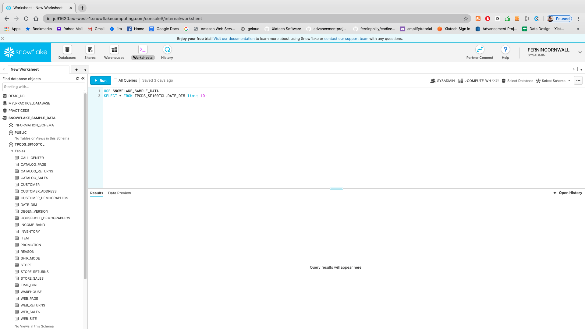
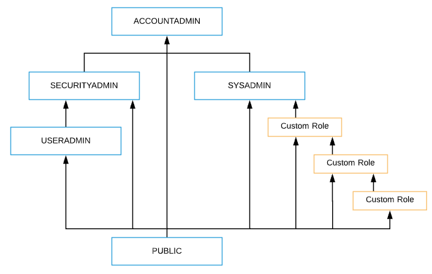
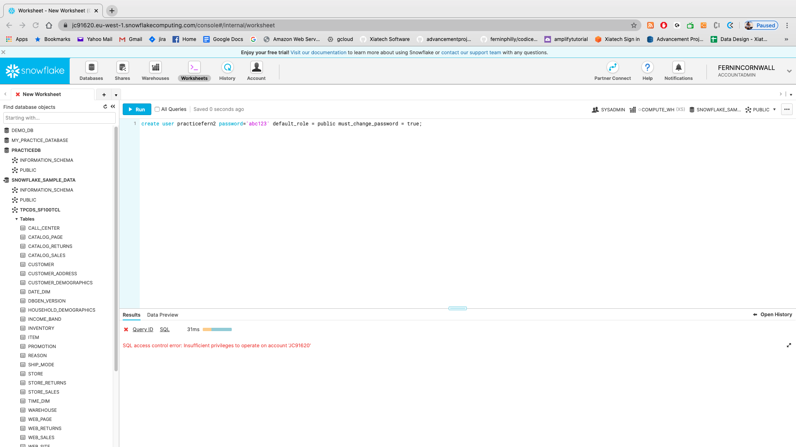

# Lab ONE

## Hooking up to your local GUI

So- before we get started with Snowflake let's get it hooked up to our local system! 
There are numerous ways to interface with snowflake. The obvious (read: default) way to create interactions is through the WEB GUI interface which you probably created in the initial set up lab:



_However_: we have options!

### CHALLENGE ONE: Hook up a local client to SNOWFLAKE (about 30 minutes):

IF you have any of the following GUIs locally please take the next 10 minutes to see if you can get hooked up with them. 
For most of the class we will be utilizing the web GUI (the default method) but the following local clients also work:

* [Datagrip](https://www.jetbrains.com/datagrip/) by Jetbrains. This is my preferred method because you can have one GUI that hooks up to Postgresql, Mysql, MSSQL, Snowflake, Hadoop, Redshift, etc.

* [SQLWorkbench](https://support.snowflake.net/s/article/configuring-sql-workbenchj-to-use-snowflake): Will need the JDBC driver

* [DBeaver](https://www.cdata.com/kb/tech/snowflake-jdbc-dbvr.rst) for which you will also need a JDBC driver

## USER MANAGEMENT

Okay- so first off.. congratulations to everyone for becoming DBAs! Welcome to the most thankless, angry job in the world:


One of the biggest parts of the DBA job is to manage **users**. With Snowflake this is pretty easy but we'll want to go through it to make sure that everyone is managed effectively.

Snowflake comes with several Pre-defined roles. They are:

* **ACCOUNTADMIN:** (aka Account Administrator)
  * Role that encapsulates the SYSADMIN and SECURITYADMIN system-defined roles. It is the top-level role in the system and should be granted only to a limited/controlled number of users in your account.

* **SECURITYADMIN:** (aka Security Administrator)
  
  * Role that can monitor, and manage users and roles. More specifically, this role is used to:

  * Modify and monitor any user, role, or session.

  * Modify any grant, including revoking it.

* **USERADMIN:** (aka User and Role Administrator)

  * Role that can create users and roles. More specifically, this role is used to:

  * Create users and roles in your account (and grant those privileges to other roles).

* **SYSADMIN:** (aka System Administrator)

  * Role that has privileges to create warehouses and databases (and other objects) in an account.

  * If, as recommended, you create a role hierarchy that ultimately assigns all custom roles to the SYSADMIN role, this role also has the ability to grant privileges on warehouses, databases, and other objects to other roles.

* **PUBLIC:**

  * Pseudo-role that is automatically granted to every user and every role in your account. The PUBLIC role can own securable objects, just like any other role; however, the objects owned by the role are, by definition, available to every other user and role in your account.

  * This role is typically used in cases where explicit access control is not needed and all users are viewed as equal with regard to their access rights.



SO...let's start with creating a basic user! Let's check the user menu. ON THE GUI:

* Click on the **SNOWFLAKE_SAMPLE_DATA** Database and return to a menu that has a SQL Entry GUI (you can also click on SNOWFLAKE logo in the top left hand corner to get here):


* Now utilizing this code we can effectively create a user:

```
CREATE USER practicefern password='somepass' default_role = public must_change_password = true;
```

SO...go in and try to run that code. Let's see what comes back....



Wait, WTF?


SO...as it turns out we don't currently have sufficient permissions to run that user. That must be rectified quickly.
In order to do this let's update our permissions to allow it. To do this we need to look at updating our **ROLE**

So to do this we need to upgrade our role. 
Let's take a quick look at what our role IS:

`SELECT current_role()`

Now- remember from our lecture portion how the users permissions work. Considering that:

### CHALLENGE TWO: UPDATE YOUR ROLE SO THAT YOU CAN RUN THE CREATE USER COMMAND


Snowflake’s approach to access control combines aspects from both of the following models:

* **Discretionary Access Control (DAC):** Each object has an owner, who can in turn grant access to that object.

* **Role-based Access Control (RBAC):** Access privileges are assigned to roles, which are in turn assigned to users.
