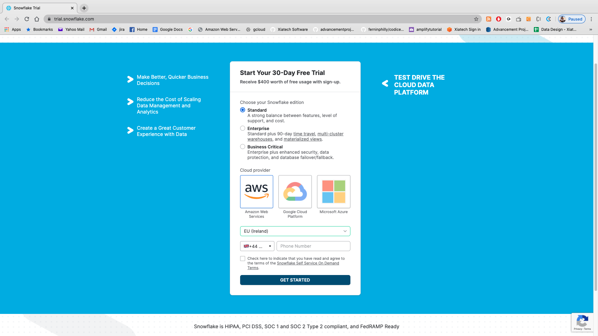
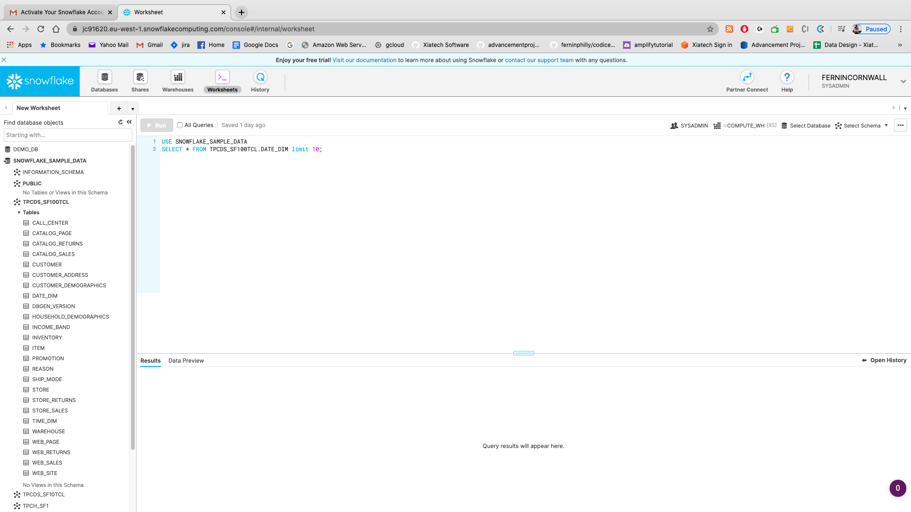
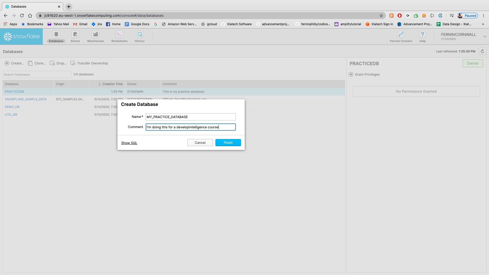

# Snowflake intensive course lab setup

## Setting up

One of the biggest issues around snowflake is the fact that we can't simply grab a docker version of it; Snowflake keeps their data close!
So this means that unfortunately we _have_ to sign up for the 30 day free trial of snowflake...which we're going to have to do here.
Head over to [this](https://trial.snowflake.com/) site and please fill in the appropriate data.

* Please choose AWS as your **cloud provider**

Once you have completed registration (and clicked the activation link in your email) you are ready to go! You should see a screen that looks vaguely like this:

### Let's explore our initial screen!

SO- now that we are registered let's take a quick tour of some of the sections of our screen. Take a look at the top area (next to the snowflake logo):

You should see five areas immediately next to the snowflake section:
* Databases
* Shares
* Warehouses
* Worksheets
* History

Let's go through each of these as an intro:

### Databases

So let's start by creating a database (pretty basic, right?). Okay- so to create a database we can follow the GUI. Click on the "CREATE" and put in the names below:

Now click on your database name and we get to a screen with several tabs (under "DATABASES"). You should see seven tabs there:

* **Tables:** Fairly obvious: this is the list of tables. We can create one here with the "+" in the top left. 

* **Views:** Same as in other SQL databases- views are sql-generated tables that we can use for things like limiting date ranges on large tables.

* **Schemas:** Essentially one step down from "databases". For anyone not familiar with the hierarchy: DATABASES can contain multiple SCHEMAS which can contain multiple TABLES:

**Please take action here:** Let's create a schema here called "practice"

* **Stages:** Now _this_ is something you might not be used to seeing (and we'll cover this in more detail later). **Stages** in Snowflake are, essentially, external data repositories. I'm going to quote a pretty popular blog about it here:

> A critical part of any Snowflake database is the storage of the data. Snowflake is capable of
> both storing data within the environment and accessing data that is stored in other cloud 
> storage environments. Regardless of whether the data is stored internally or externally, the
> location the data is stored in is known as a stage. In turn, the process of uploading files
> into one of these stages is known as staging. [source](https://interworks.com/blog/chastie/2019/12/05/zero-to-snowflake-staging-explained/)

* **File Formats:** One of the nice things about Snowflake is the easy loading of data from various file formats. This is another thing we'll go into more detail about later but in the short term there are several formats available, including **semi-structured** and **structured** for loading data. In the short term, open up the "Format type" and take a quick look at the various format types available:

* **Sequences:** Another thing that we'll go into more detail about later is the concept of "sequences" in Snowflake...so take this one with a grain of salt. That being said: in the short term just think of sequences as a "primary key creator".

* **Pipes:** Snowflakes version of data pipelines...yet ANOTHER thing we'll be going deeper into later but the short version is: Snowpipes are sort of event driven data pipelines for loading data into Snowflake (so we can avoid having to use batches and COPY commands)

